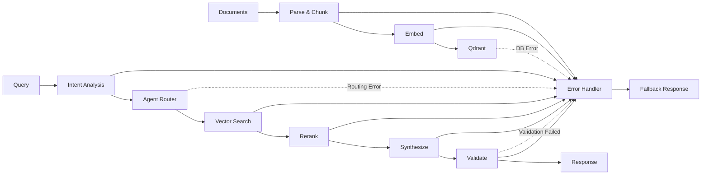

# CPSKDB: Agentic RAG System

## Executive Summary

**Mission**: Building a locally hosted, agentic Retrieval-Augmented
Generation (RAG) system for multi-product technical data with high accuracy,
auditability, and data privacy.

**Current Status**: Task 99 - Implementing comprehensive Docker Compose test
scenarios (32/87 completed)

---

## 🏗️ System Architecture

### Core Data Flow



### Multi-Agent Framework (LangGraph)

- **🧠 Supervisor**: Intent classification & routing
- **🔍 Specialists**: Domain-specific retrieval
- **🔗 Cross-Reference**: Inter-product correlations
- **⚡ Synthesis**: Context aggregation
- **✅ Validation**: Quality assurance & guardrails

### Technology Stack

```yaml
Infrastructure:
  api: FastAPI (async)
  vector_db: Qdrant (port 6333)
  metadata: PostgreSQL (port 5432) # optional/future: not in current compose
  cache: Redis (port 6379) # optional/future: not in current compose
  llm: Ollama (port 11434) # optional/future: not in current compose

AI_ML:
  orchestration: LangGraph
  embeddings: Voyage AI
  reranking: Cohere
  chunking: Custom semantic strategies
```

---

## 📁 Project Structure

```text
cpskdb/
├── src/                    # 🎯 Core application
│   ├── api/               # FastAPI routes & middleware
│   ├── agents/            # LangGraph workflows
│   ├── ingestion/         # Document processing pipeline
│   ├── embeddings/        # Voyage AI & local providers
│   ├── retrieval/         # Qdrant client & rerankers
│   └── models/            # Pydantic schemas
├── tests/                 # 🧪 Comprehensive test suite
│   ├── unit/             # Component testing
│   ├── integration/      # Service interactions
│   └── e2e/              # End-to-end workflows
├── docker/               # 🐳 Container configurations
├── config/               # ⚙️ Settings management
├── scripts/              # 🔧 Automation & deployment
└── docs/                 # 📚 Technical documentation
```

---

## ⚡ Quick Start

### Environment Setup

```bash
# Set up development environment
make install                # Create virtual environment and install dependencies

# Set up pre-commit hooks (recommended)
make pre-commit-install     # Install git hooks for code quality

# Copy the example environment file
cp .env.example .env

# Start the Qdrant service
docker compose up -d qdrant

# Verify the service is running
curl http://localhost:6333/healthz
```

### API Endpoints

```yaml
Core:
  - POST /api/v1/query           # Submit RAG queries
  - GET  /api/v1/query/{id}      # Retrieve results
  - POST /api/v1/feedback        # Quality feedback

Ingestion:
  - POST /api/v1/ingest/document # Upload documents
  - GET  /api/v1/ingest/status   # Processing status

System:
  - GET  /health                 # Health check
  - GET  /health/metrics         # Prometheus metrics
```

---

## 🔧 Development Workflow

### Research-First Development

**Always research before coding**:

Before writing any code, it is important to research the topic, library, or pattern you will be working with. Use web search, official documentation, or community resources to gather information.

### Test-Driven Development

```bash
# Test execution
pytest tests/unit/          # Fast component tests
pytest tests/integration/   # Service interactions
pytest tests/e2e/          # Complete workflows
pytest --cov=src tests/    # Coverage analysis

# Quality checks
ruff format .               # Code formatting
ruff check .               # Linting
mypy src/                  # Type checking
npx markdownlint-cli2 "**/*.md"  # Documentation

# Pre-commit hooks (after setting up dev environment)
make pre-commit-install     # Install git hooks (or: pre-commit install)
make pre-commit-run         # Run hooks on all files (or: pre-commit run --all-files)
```

---

## 🎯 Current Task Context

### Task 99: Docker Compose Test Implementation

**Objective**: Complete all 87 comprehensive test scenarios for Qdrant
service configuration

**Progress**: 32 unique scenarios implemented (115 total category assignments)

- ✅ Basic functionality (7 scenarios)
- ✅ Performance & resource (14 scenarios)
- ✅ Security & validation (12 scenarios)
- 🔄 Advanced integration (15 scenarios) - IN PROGRESS
- 🔄 State management (18 scenarios) - IN PROGRESS
- 🔄 Recovery & resilience (14 scenarios) - IN PROGRESS
- 🔄 Error handling & edge cases (15 scenarios) - IN PROGRESS
- ⏳ Boundary conditions (20 scenarios) - PENDING

**File**: `tests/test_docker_compose_qdrant.py` (3,151 lines)

---

## 🎨 Coding Style Guidelines

### Core Principles

**Consistency First**: Follow existing patterns in the codebase. When editing files, examine imports and surrounding code to understand framework choices and conventions.

**Type Safety**: Use comprehensive type annotations with strict mypy configuration. All functions should have proper type hints for parameters and return values.

**Error Handling**: Use structured exception hierarchies with specific error types. Never use bare `except:` clauses.

### Python Code Standards

#### 1. Formatting & Structure

**Line Length**: 88 characters (Black/Ruff standard)
**Imports**: Organized by isort - stdlib, third-party, first-party (`cpskdb`)
**Quotes**: Double quotes for strings (Black normalization)

```python
# Good: Proper import organization
import asyncio
from pathlib import Path
from typing import Optional

import httpx
from fastapi import HTTPException
from pydantic import BaseModel

from cpskdb.models import QueryRequest
```

#### 2. Naming Conventions

```python
# Classes: PascalCase
class DocumentProcessor:
    """Process documents for ingestion pipeline."""

# Functions/variables: snake_case
async def process_document(document_path: Path) -> ProcessedDocument:
    """Process a single document."""

# Constants: UPPER_SNAKE_CASE
DEFAULT_TIMEOUT = 30
API_VERSION = "v1"

# Private members: _leading_underscore
def _validate_input(self, data: str) -> bool:
    """Internal validation method."""
```

#### 3. Type Annotations

**Strict Typing**: Use comprehensive type hints following PEP 484/526

```python
from typing import Dict, List, Optional, Union
from collections.abc import AsyncGenerator
from pathlib import Path

# Function signatures with full type information
async def query_documents(
    query: str,
    limit: int = 10,
    filters: Optional[Dict[str, Union[str, int]]] = None,
) -> List[SearchResult]:
    """Query documents with optional filtering."""

# Generic types for reusable components
T = TypeVar("T")
class Repository(Generic[T]):
    """Generic repository pattern."""

    async def get_by_id(self, id: str) -> Optional[T]:
        """Retrieve entity by ID."""
```

#### 4. Error Handling

**Structured Exceptions**: Create hierarchy for different error types

```python
class CPSKDBError(Exception):
    """Base exception for all CPSKDB errors."""

class ValidationError(CPSKDBError):
    """Data validation failed."""

class ExternalServiceError(CPSKDBError):
    """External service integration error."""

    def __init__(
        self,
        service_name: str,
        message: str,
        status_code: Optional[int] = None
    ):
        self.service_name = service_name
        self.status_code = status_code
        super().__init__(f"{service_name}: {message}")

# Usage in functions
async def call_external_api(url: str) -> ApiResponse:
    """Call external API with proper error handling."""
    try:
        async with httpx.AsyncClient() as client:
            response = await client.get(url, timeout=30)
            response.raise_for_status()
            return ApiResponse.model_validate(response.json())
    except httpx.HTTPError as e:
        raise ExternalServiceError("API", str(e), getattr(e, "status_code", None)) from e
```

### FastAPI Patterns

#### 1. Route Organization

```python
from fastapi import APIRouter, Depends, HTTPException, status
from sqlalchemy.ext.asyncio import AsyncSession

from cpskdb.dependencies import get_db, verify_token
from cpskdb.models import DocumentCreate, DocumentResponse
from cpskdb.services import DocumentService

router = APIRouter(prefix="/api/v1/documents", tags=["documents"])

@router.post("/", response_model=DocumentResponse, status_code=status.HTTP_201_CREATED)
async def create_document(
    document: DocumentCreate,
    db: AsyncSession = Depends(get_db),
    current_user: User = Depends(verify_token),
) -> DocumentResponse:
    """Create new document with validation."""
    try:
        result = await DocumentService.create(db, document, current_user.id)
        return result
    except ValidationError as e:
        raise HTTPException(status_code=400, detail=str(e)) from e
```

#### 2. Dependency Injection

```python
# Dependencies with proper typing and error handling
async def get_db() -> AsyncGenerator[AsyncSession, None]:
    """Database session dependency."""
    async with AsyncSessionLocal() as session:
        try:
            yield session
        finally:
            await session.close()

async def verify_token(
    authorization: str = Header(None)
) -> User:
    """JWT token verification dependency."""
    if not authorization or not authorization.startswith("Bearer "):
        raise HTTPException(
            status_code=status.HTTP_401_UNAUTHORIZED,
            detail="Invalid authorization header"
        )
    # Token validation logic...
```

### Async Programming Standards

#### 1. Resource Management

```python
from contextlib import asynccontextmanager
from typing import AsyncGenerator

@asynccontextmanager
async def managed_client() -> AsyncGenerator[httpx.AsyncClient, None]:
    """Managed HTTP client with proper cleanup."""
    client = httpx.AsyncClient(timeout=30)
    try:
        yield client
    finally:
        await client.aclose()

# Usage with timeout handling
async def fetch_data(url: str) -> Dict[str, Any]:
    """Fetch data with timeout and resource management."""
    async with managed_client() as client:
        try:
            async with asyncio.timeout(30):  # Python 3.11+
                response = await client.get(url)
                return response.json()
        except asyncio.TimeoutError as e:
            raise ExternalServiceError("API", "Request timeout") from e
```

#### 2. Concurrency Patterns

```python
# Proper async batching
async def process_documents_batch(
    documents: List[Document]
) -> List[ProcessedDocument]:
    """Process multiple documents concurrently."""
    semaphore = asyncio.Semaphore(5)  # Limit concurrency

    async def process_single(doc: Document) -> ProcessedDocument:
        async with semaphore:
            return await document_processor.process(doc)

    tasks = [process_single(doc) for doc in documents]
    return await asyncio.gather(*tasks, return_exceptions=False)
```

### Documentation Standards

#### 1. Docstring Format (Google Style)

```python
def query_vector_database(
    query_vector: List[float],
    collection_name: str,
    limit: int = 10,
    score_threshold: float = 0.7,
) -> List[SearchResult]:
    """Query vector database for similar documents.

    Performs similarity search against the specified collection using
    cosine similarity scoring.

    Args:
        query_vector: Dense vector representation of the query.
        collection_name: Name of the Qdrant collection to search.
        limit: Maximum number of results to return.
        score_threshold: Minimum similarity score for results.

    Returns:
        List of search results ordered by similarity score.

    Raises:
        ValidationError: If query_vector is empty or malformed.
        ExternalServiceError: If Qdrant connection fails.

    Example:
        >>> results = await query_vector_database(
        ...     query_vector=[0.1, 0.2, 0.3],
        ...     collection_name="documents",
        ...     limit=5
        ... )
        >>> len(results) <= 5
        True
    """
```

### Test Organization

#### 1. Test Structure & Naming

```python
# File: tests/unit/test_document_service.py
import pytest
from unittest.mock import AsyncMock

from cpskdb.services import DocumentService
from cpskdb.models import DocumentCreate

class TestDocumentService:
    """Test suite for DocumentService class."""

    async def test_create_document_success(
        self,
        document_service: DocumentService,
        sample_document: DocumentCreate
    ):
        """Test successful document creation with valid data.

        Verifies that a document can be created with proper
        validation and returns expected response format.
        """
        # Arrange
        expected_id = "doc-123"

        # Act
        result = await document_service.create(sample_document)

        # Assert
        assert result.id == expected_id
        assert result.title == sample_document.title
```

#### 2. Fixture Organization

```python
# File: tests/conftest.py
@pytest.fixture
async def document_service() -> DocumentService:
    """Document service with mocked dependencies."""
    mock_db = AsyncMock()
    return DocumentService(db=mock_db)

@pytest.fixture
def sample_document() -> DocumentCreate:
    """Sample document for testing."""
    return DocumentCreate(
        title="Test Document",
        content="Test content",
        category="technical"
    )
```

### Configuration Management

#### 1. Settings Classes

```python
from pydantic import BaseSettings, Field
from typing import Optional

class DatabaseSettings(BaseSettings):
    """Database connection configuration."""

    host: str = Field(default="localhost", description="Database host")
    port: int = Field(default=5432, description="Database port")
    name: str = Field(description="Database name")
    user: str = Field(description="Database user")
    password: str = Field(description="Database password")

    # Connection pool settings
    pool_size: int = Field(default=10, description="Connection pool size")
    max_overflow: int = Field(default=20, description="Max overflow connections")

    class Config:
        env_prefix = "DB_"
        env_file = ".env"

    @property
    def url(self) -> str:
        """Construct database URL."""
        return f"postgresql://{self.user}:{self.password}@{self.host}:{self.port}/{self.name}"
```

### Security Best Practices

#### 1. Input Validation

```python
from pydantic import BaseModel, Field, validator

class QueryRequest(BaseModel):
    """RAG query request with validation."""

    query: str = Field(
        min_length=1,
        max_length=1000,
        description="User query text"
    )
    filters: Optional[Dict[str, str]] = Field(
        default=None,
        description="Optional query filters"
    )

    @validator("query")
    def validate_query(cls, v: str) -> str:
        """Validate and sanitize query text."""
        if not v.strip():
            raise ValueError("Query cannot be empty")
        return v.strip()
```

#### 2. Secrets Management

```python
# Never commit secrets - use environment variables
import os
from functools import lru_cache

@lru_cache()
def get_api_key() -> str:
    """Get API key from environment."""
    key = os.getenv("VOYAGE_API_KEY")
    if not key:
        raise ValueError("VOYAGE_API_KEY environment variable not set")
    return key
```

### Performance Optimization

#### 1. Caching Strategies

```python
from functools import lru_cache
import asyncio

class TextProcessor:
    """Text processing with caching."""

    def __init__(self):
        self._cache_lock = asyncio.Lock()
        self._async_cache: Dict[str, str] = {}

    @lru_cache(maxsize=1000)
    def normalize_text(self, text: str) -> str:
        """Synchronous text normalization with LRU cache."""
        return text.lower().strip()

    async def process_text_async(self, text: str) -> str:
        """Async text processing with manual caching."""
        cache_key = f"processed_{hash(text)}"

        async with self._cache_lock:
            if cache_key in self._async_cache:
                return self._async_cache[cache_key]

            result = await self._expensive_processing(text)
            self._async_cache[cache_key] = result
            return result
```

### Quality Enforcement

The project uses automated tools configured in `pyproject.toml`:

- **Ruff**: Linting and formatting (replaces flake8, isort, pyupgrade)
- **MyPy**: Static type checking with strict mode
- **Black**: Code formatting (88 character line length)
- **Pre-commit**: Automated quality checks on commit

Run quality checks:
```bash
ruff format .      # Format code
ruff check .       # Lint code
mypy src/         # Type checking
pytest            # Run tests
```

**Key Configuration Values:**
- Line length: 88 characters
- Type checking: Strict mode enabled
- Import sorting: stdlib → third-party → local
- Docstring style: Google convention
- Max complexity: 10 (McCabe)
- Max function arguments: 5

---

## 📋 Quality Standards

### Immediate Action Items

When detected, fix IMMEDIATELY:

- **Ruff formatting**: `ruff format`
- **Ruff linting**: Import errors, unused variables
- **Mypy issues**: Type annotations, stubs
- **LanguageTool**: Add false positives to dictionary

### LanguageTool Dictionary

Location: `scripts/languagetool_personal_dict.txt`

Common terms already added:

- Frameworks: `FastAPI`, `LangGraph`, `Qdrant`, `Redis`, `Ollama`
- Python: `pytest`, `pydantic`, `subprocess`, `tempfile`
- Classes: `TestQdrantDockerCompose`, `DatabaseSettings`
- Acronyms: `API`, `JSON`, `TDD`, `RAG`, `LLM`

---

## 🔒 Git & Security

### Repository Info

- **URL**: https://github.com/osbornesec/cpskdb
- **Owner**: CPSKDB Maintainers (contact via GitHub Issues/Discussions)
- **Branch**: main
### Commit Standards

```text
<type>: <subject>

<body>

🤖 Generated with AI assistance
```

**Types**: `feat`, `fix`, `docs`, `test`, `refactor`, `chore`

### Security Rules

**NEVER COMMIT**:

- API keys, credentials, secrets
- `.env` files with sensitive data
- Large model files, datasets
- Database dumps, backups

---

## 🎯 Success Metrics

### Completion Criteria

- [ ] All 87 test scenarios implemented
- [ ] Docker Compose configuration validated
- [ ] Health checks properly configured
- [ ] Volume persistence verified
- [ ] Network isolation tested
- [ ] Error handling comprehensive
- [ ] Performance benchmarks established

### Quality Gates

- [ ] All tests pass (unit, integration, e2e)
- [ ] Code quality tools pass (ruff, mypy)
- [ ] Documentation validated (markdownlint)
- [ ] Security scan clean
- [ ] Performance within limits

---

## 📚 Knowledge Integration

### Documentation Research

**Always use before coding**:

```bash
@agent-context7-docs-searcher "Research [specific need]"
```

---

## 🎯 Development Environment

### Docker Compose Services

**Current (default compose):**

- **Qdrant** (port 6333): Vector database with persistence

**Full Stack (optional/future):**

- **PostgreSQL** (port 5432): Metadata and audit logs
- **Redis** (port 6379): Caching and session storage
- **Ollama** (port 11434): Local LLM inference

### Configuration Structure

**Pydantic Settings Classes**:

- `DatabaseSettings`: Connection configs and pool settings
- `EmbeddingSettings`: Provider configs and rate limits
- `AgentSettings`: LLM parameters and workflow configs
- `APISettings`: Server configs and middleware settings

---

**🎯 Current Focus**: Complete remaining 55 test scenarios for comprehensive
Docker Compose validation following TDD methodology.

---

## Important Instruction Reminders

Do what has been asked; nothing more, nothing less.
ALWAYS use @agent-context7-docs-searcher BEFORE writing any code.
For ALL documentation research, use @agent-context7-docs-searcher.
